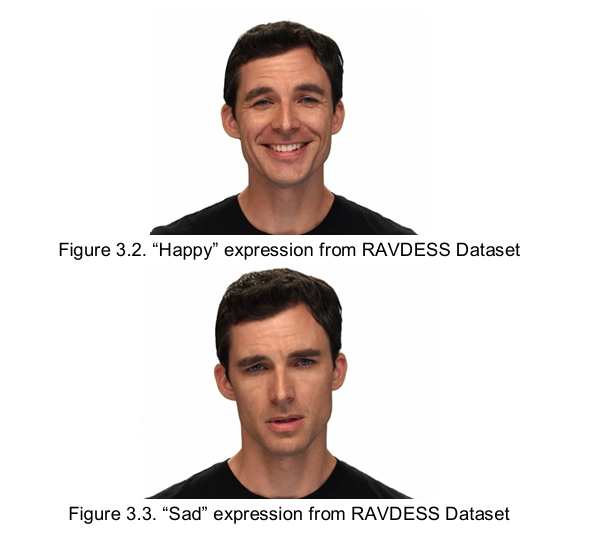
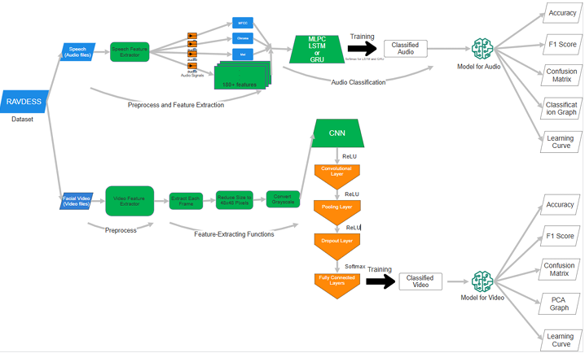
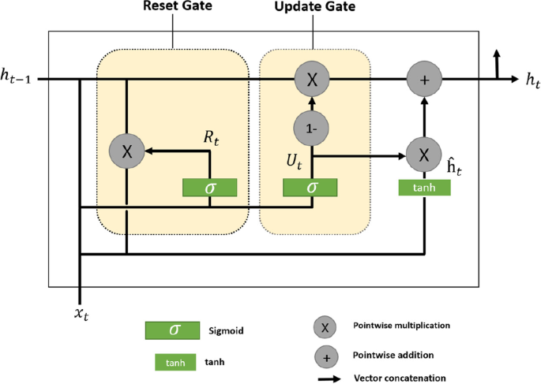
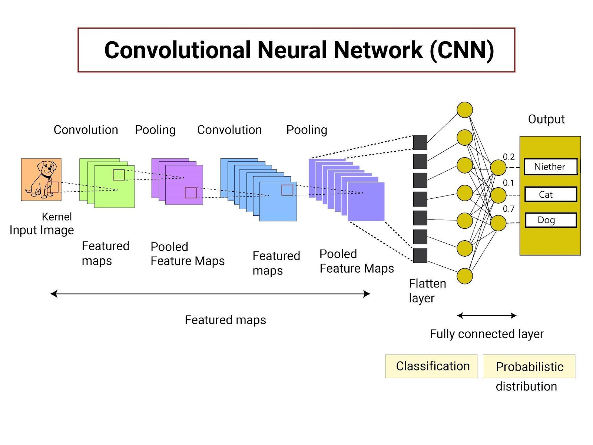
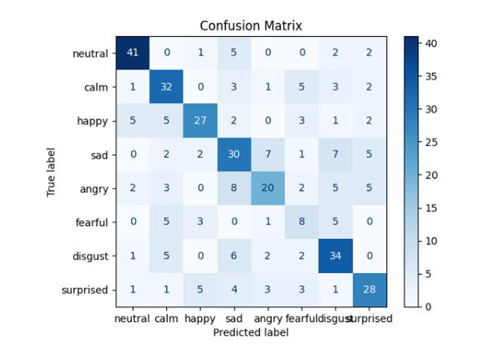
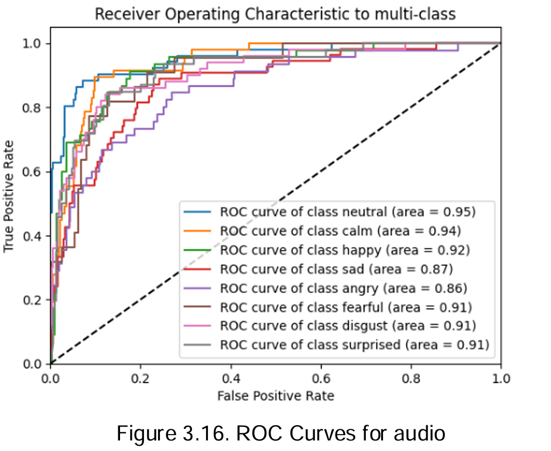
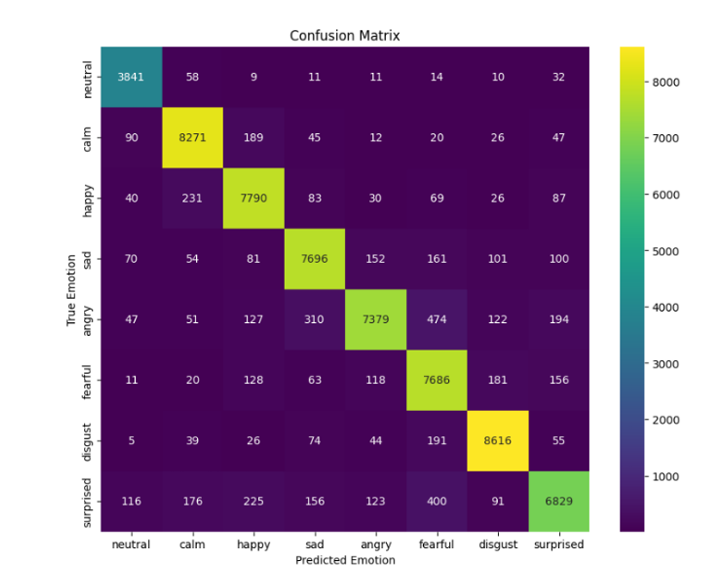
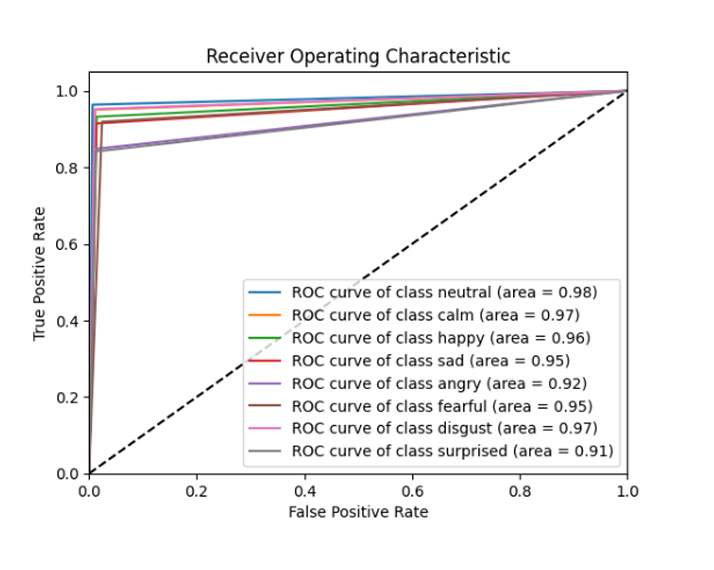

# Multimodal Emotion Recognition Using Audio and Video

## 📌 Project Description
This project aims to develop a **multimodal emotion recognition system** that processes both **audio** and **video** data to classify human emotions. The model combines deep learning techniques, using **Gated Recurrent Units (GRU) for audio processing** and **Convolutional Neural Networks (CNN) for video processing**. This system can be used in various fields, including **human-computer interaction, mental health monitoring, and affective computing**.

## 🎯 Key Features
- Uses **RAVDESS** dataset (Ryerson Audio-Visual Database of Emotional Speech and Song).
- **Feature extraction techniques**: MFCC, Chroma, Mel-spectrogram for audio; grayscale frame extraction for video.
- **Deep learning architectures**: GRU-based recurrent model for audio, CNN-based model for video.
- **Evaluation metrics**: Accuracy, F1-score, Confusion Matrix, ROC Curve.

## 📂 Dataset
The model uses the **RAVDESS dataset**, which consists of:
- **1440 audio files** (spoken statements with different emotions).
- **1440 video recordings** (corresponding facial expressions).
- **8 emotion categories**: Neutral, Calm, Happy, Sad, Angry, Fearful, Disgust, Surprised.

📌 *Example From Dataset:*


## 📊 Workflow
The flowchart below provides an overview of the entire process from data acquisition to classification:

📌 *Workflow Representation:* 


## 🏗️ Model Architecture
### 🎵 **Audio Processing Pipeline**
1. **Feature Extraction:** MFCC, Chroma, and Mel-spectrogram features extracted using `librosa`.
2. **GRU Model:** Three stacked **GRU layers** with 256, 256, and 128 units.
3. **Batch Normalization & Dense Layers:** Flatten layer followed by softmax output for classification.

📌 *Model architecture representation:* 


### 🎥 **Video Processing Pipeline**
1. **Frame Extraction:** Grayscale frames extracted using `OpenCV`.
2. **CNN Model:** 4 convolutional layers with max-pooling and dropout.
3. **Fully Connected Layer:** Dense layers for final classification.

📌 *Model architecture representation:* 


## ⚙️ Installation & Setup
### 1️⃣ Clone the Repository
```sh
git clone https://github.com/ozy-7/multimodal-emotion-recognition.git
cd multimodal-emotion-recognition
```

### 2️⃣ Run the Model
To train the **audio model**:
```sh
python main_audio.py
```
To train the **video model**:
```sh
python main_video.py
```

## 📊 Results & Evaluation
The model was evaluated using **accuracy, F1-score, confusion matrix, and ROC curves**.

### 🎵 **Audio Model Results**
- **Accuracy**: ~91%
- **Confusion Matrix**:
-  
- **ROC Curves**:
-  

### 🎥 **Video Model Results**
- **Accuracy**: ~93%
- **Confusion Matrix**:
-  
- **ROC Curves**:
- 

## 🔮 Future Improvements
- **Fusion Techniques**: Improve integration of audio and video models for higher accuracy.
- **More Robust Dataset**: Train on larger, more diverse datasets.
- **Real-time Processing**: Optimize model for real-time emotion recognition.

---
🚀 This project explores the power of multimodal deep learning for emotion recognition.
